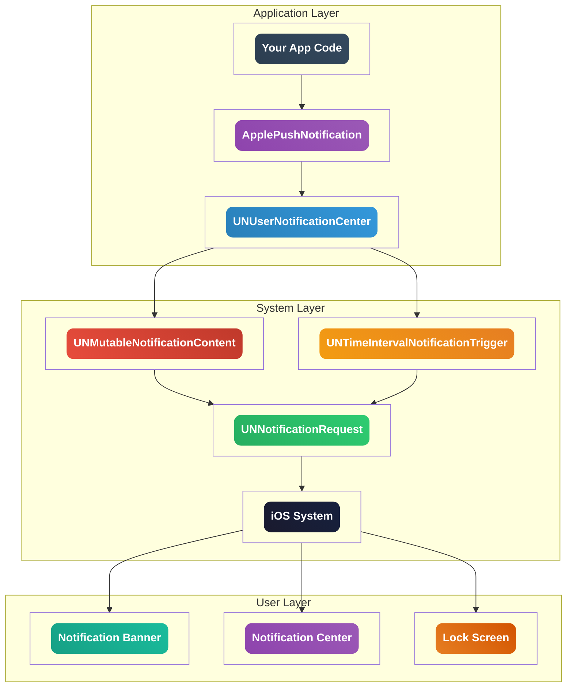

<div align="center">

# 🍎 Apple Push Notification System

[](https://developer.apple.com/ios/)
[](LICENSE)
[](https://www.apple.com/ios/)
[](https://developer.apple.com/library/archive/documentation/Cocoa/Conceptual/ProgrammingWithObjectiveC/Introduction/Introduction.html)

**A simple, local push notification for iOS**

[Features](#-features) • [Installation](#-installation) • [Usage](#-usage) • [Examples](#-examples)

</div>

---


## 🎯 Overview

**Apple Push Notification** is a lightweight, efficient local notification system designed specifically for iOS applications. Unlike traditional push notifications that require external servers, this system operates entirely locally on the device.

### ✨ Key Benefits

> 💡 **Local Operation** - No external server dependencies
> 
> 🎯 **System Integration** - Seamless iOS experience
> 
> ⚡ **Instant Delivery** - Immediate notification display
> 
> 🔒 **Privacy Focused** - All data stays on device

---

## 🏗️ Architecture

<div align="center">



</div>


---

## 📦 Installation

### Prerequisites

- iOS 10.0 or later
- Xcode 12.0 or later (or Theos)
- Objective-C project

### Setup

1. **Add files to your project:**
   ```bash
   ApplePushNotification.h
   ApplePushNotification.mm
   ```

2. **Import in your project:**
   ```objc
   #import "ApplePushNotification.h"
   ```

3. **Request permissions in setup:**
   ```objc
   [ApplePushNotification requestPermissions];
   ```

---

## ⚡ Quick Start

```objc
// 1. Import the header
#import "ApplePushNotification.h"

// 2. Request permissions (in setup)
[ApplePushNotification requestPermissions];

// 3. Send a basic notification
[ApplePushNotification Notification:@"Hello World" 
                            message:@"This is your first notification!"];

// 4. Send with subtitle
[ApplePushNotification NotificationWithSubtitle:@"Status Update" 
                                       subtitle:@"System" 
                                        message:@"Everything is working perfectly!"];
```

---

## 📖 Usage

### 🔔 Basic Notification

```objc
[ApplePushNotification Notification:@"Title" message:@"Description"];
```

**Features:**
- ✅ Title
- ✅ Description  
- ✅ Default sound
- ✅ Badge (1)

### 📝 Notification with Subtitle

```objc
[ApplePushNotification NotificationWithSubtitle:@"Title" 
                                       subtitle:@"Subtitle" 
                                        message:@"Description"];
```

**Features:**
- ✅ Title
- ✅ Subtitle
- ✅ Description
- ✅ Default sound

### 🔐 Permission Management

```objc
// Check if notifications are enabled
if ([ApplePushNotification isEnabled]) {
    // Send notification
    [ApplePushNotification Notification:@"Test" message:@"It works!"];
} else {
    // Request permissions
    [ApplePushNotification requestPermissions];
}
```


---

## 💡 Examples

### 🎯 Example 1: Status Notification


```objc
dispatch_after(dispatch_time(DISPATCH_TIME_NOW, (int64_t)(2.0 * NSEC_PER_SEC)), dispatch_get_main_queue(), ^{
    [ApplePushNotification Notification:@"System Ready" 
                                message:@"Application has been successfully started"];
});
```

### 🎯 Example 2: Feature Activation


```objc
dispatch_after(dispatch_time(DISPATCH_TIME_NOW, (int64_t)(4.0 * NSEC_PER_SEC)), dispatch_get_main_queue(), ^{
    [ApplePushNotification NotificationWithSubtitle:@"Feature Activated" 
                                           subtitle:@"Radar System" 
                                            message:@"Radar has been enabled"];
});
```


## ⚠️ Requirements

<div align="center">

| Requirement | Version | Notes |
|:-----------:|:-------:|:------|
| **iOS** | 10.0+ | Minimum supported version |
| **Xcode** | 12.0+ | For compilation (or Theos) |
| **Framework** | UserNotifications | System framework |
| **Permissions** | User consent | Required for notifications |

</div>

---

## 🔒 Limitations

> ⚠️ **Limited Customization** - Appearance controlled by iOS
> 
> 🚫 **No Animations** - Static display only
> 
> 🔧 **System Dependent** - Follows iOS notification rules
> 
> 🔊 **Sound Control** - Uses system default sound


---

## 📄 License

This project is licensed under the MIT License - see the [LICENSE](LICENSE) file for details.

---

## 🙏 Credits

This project is based on the excellent work by [nbhasin2/LocalPushNotification](https://github.com/nbhasin2/LocalPushNotification/tree/main) - a simple iOS Swift app for local push notifications. I've adapted and enhanced their implementation for Objective-C with additional features and improved documentation.

**Original Project:** [LocalPushNotification](https://github.com/nbhasin2/LocalPushNotification/tree/main) by [nbhasin2](https://github.com/nbhasin2)

---

<div align="center">

**Made with ❤️ by Alex Zero**

</div> 
